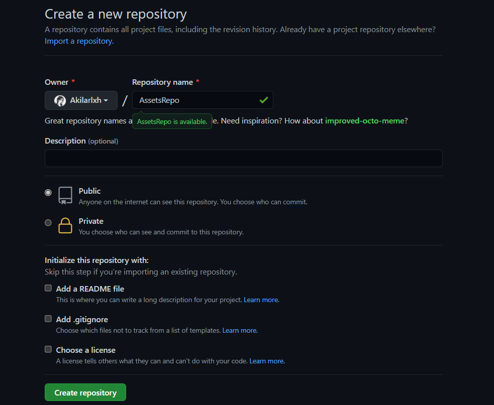
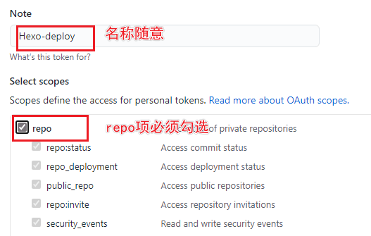
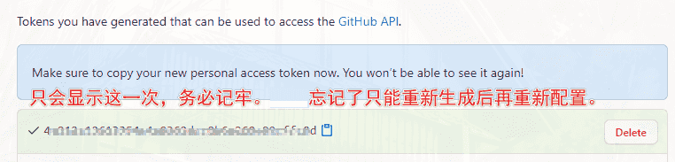
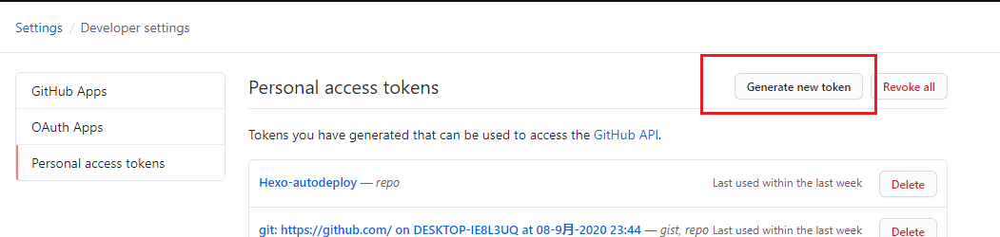
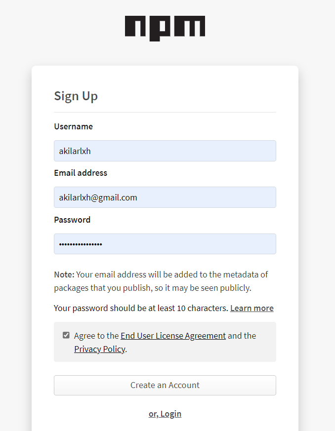
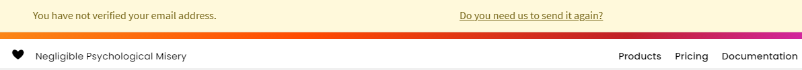
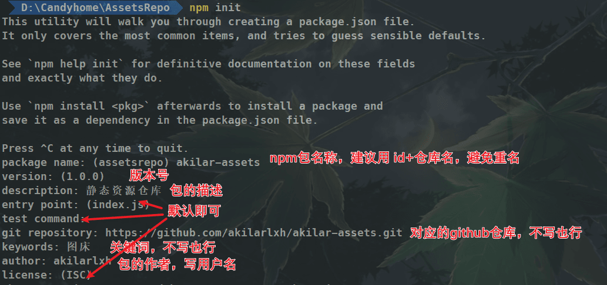
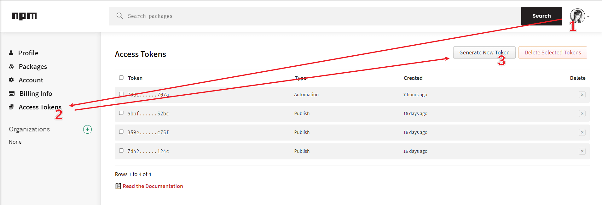
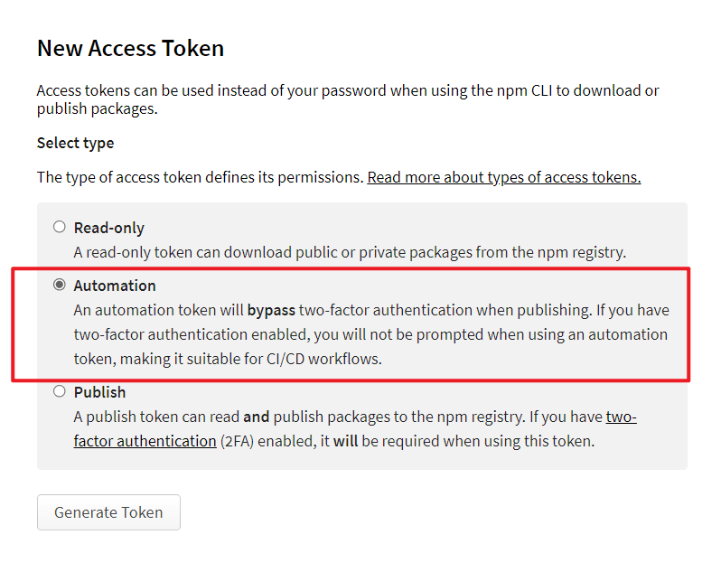
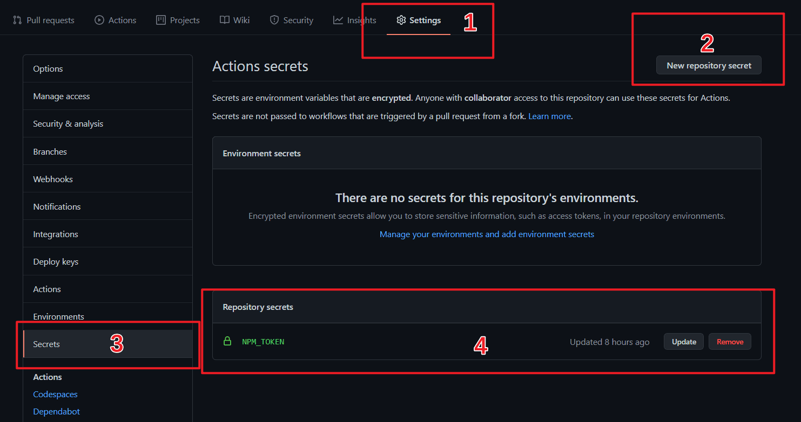

# npm 图床搭建

我的博客主题版本为：hexo5.4、Butterfly3.6.2

如果与我的版本不一样可能会有略微差别，届时请自行百度。

本文参考文章：[Akilar の糖果屋的《npm 图床的使用技巧》](https://akilar.top/posts/3e956346/)。


## 1. 创建一个 GitHub 仓库存储图片

1. 首先创建一个图床仓库用来存放图片，仓库名随意。以下会以 `[AssetsRepo]` 指代这个静态资源仓库。

   

2. 访问 (Github-> 头像（右上角）->Settings->Developer Settings->Personal access tokens)[[Personal Access Tokens (Classic) (github.com)](https://github.com/settings/tokens)]->`generate new token`, 创建的 `Token` 名称随意，但必须勾选 `repo` 项。


   

`token` 只会显示这一次，之后将无法查看，所以务必保证你已经记录下了 `Token`。之后如果忘记了就只能重新生成重新配置了。

## 2. npm 图床使用

1. 首先需要注册一个 npm 的账号。访问 (npm 注册页面)[https://www.npmjs.com/signup/]

   

2. 完成邮箱验证，注册完成后进入账号管理界面:`头像` ->`Account`，拉倒最上方，你会看到 `You have not verified your email address` 字样的提示，点击以后按提示步骤验证你的邮箱。


3. 找到我们之前创建的图床仓库，在本地合适的位置把它 `clone `下来。找个空文件夹打开终端输入：

   ```
   git clone git@github.com:[username]/[AssetsRepo].git
   #或者
   git clone https://github.com/[username]/[AssetsRepo].git
   ```

4. 在 clone 下来的 [AssetsRepo] 文件夹内打开终端，输入以下指令切换回原生源：

   ```
   npm config set registry https://registry.npmjs.org
   ```

5. 添加本地 npm 用户设置

   ```
   # 仅第一次使用需要添加用户，之后会提示你输入你的npm账号密码以及注册邮箱
   npm adduser
   # 非第一次使用直接登录即可，之后会提示你输入你的npm账号密码以及注册邮箱
   npm login
   ```

6. 运行 npm 初始化指令，把整个图床仓库打包，按照指示进行配置，`注意需要事先确认你的包名没有和别人已发布的包重复`，可以在 `npm 官网`搜索相应包名，搜不到就说明还没被占用。

   ```
   npm init
   ```



   最后会输出一段 package.json，请求确认，输入 yes 即可。

7. 然后输入发布指令，我们就可以把包发布到 npm 上了。

   ```
   npm publish
   ```

8. jsdelivr+npm 的图片引用和 jsdelivr+github 很相似，例如：访问我在 `[AssetsRepo]` 仓库里存放的 `/img/index.png。`

   ```
   # jsDelivr+github链接
   https://cdn.jsdelivr.net/gh/[GithubUserName]/[AssetsRepo]/img/index.png
   # jsDelivr+npm链接
   https://cdn.jsdelivr.net/npm/[NpmPackageName]/img/index.png
   ```

   可以看到 Npm 只需要提供包名即可。这也是一开始要求包名不重复的原因之一

   jsDelivr+Npm 依然有 100MB 的包大小限制，但是 NPM 有丰富的国内节点。可以挑选一个使用。个人推荐知乎的。没有大小限制，而且也很稳定。

   ```
   	【jsd出品，网宿国内节点】
   	https://cdn.jsdelivr.net/npm/:package@:version/:file
   	【知乎出品，网宿国内节点】
   	主域名国内访问速度较慢，但有适合国内访问的镜像地址
   	主域名：https://unpkg.com/:package@:version/:file
   	镜像地址：https://unpkg.zhimg.com/:package@:version/:file
   	【百度出品，网宿国内节点】
   	https://code.bdstatic.com/npm/:package@:version/:file
   	【饿了么出品，网宿国内节点】
   https://npm.elemecdn.com/:package@:version/:file
   	https://shadow.elemecdn.com/npm/:package@:version/:file
   ```

## 4. 使用 GitHub Action 自动发布 npm 包

如果每次都要在本地进行 `npm publish` 的话，npm 的提交是整个包一起上传的，不存在增量更新，耗时不说，而且还往往需要架梯子才能正常上传。所以我们可以把它交给 github action 来完成。

1. 在 npm 官网 ->`头像` ->`Access Tokens`->`Generate New Token`, 勾选`Automation` 选项，然后点击`Generate Token` 生成 `Token` ，`Token` 只会显示这一次，之后如果忘记了就只能重新生成重新配置了。

   



2. 在 github 的 [AssetsRepo] 仓库设置项里添加一个名为 `NPM_TOKEN` 的 `secrets`，把获取的 Npm 的 Access token 输入进去。


3. 在本地的 `[AssetsRepo] `文件夹下新建 `[AssetsRepo]/.github/workflows/autopublish.yml`, 然后输入下面内容：

   ```
   name: Node.js Package
   # 监测图床分支，2020年10月后github新建仓库默认分支改为main，记得更改
   on:
     push:
       branches:
         - master
   
   jobs:
     publish-npm:
       runs-on: ubuntu-latest
       steps:
         - uses: actions/checkout@v2
         - uses: actions/setup-node@v1
           with:
             node-version: "12.x"
             registry-url: https://registry.npmjs.org/
         - run: npm publish
           env:
             NODE_AUTH_TOKEN: ${{secrets.npm_token}}
   ```

   4. 在本地的 `[AssetsRepo] `文件夹下打开终端，运行以下指令，上传新增内容至 github，即可触发部署。

      ```
      # 将更改提交
      git add .
      git commit -m "npm publish"
      # 更新package版本号
      npm version patch
      # 推送至github触发action
      git push
      ```

      

注意：⑴. 此处的四行指令顺序严格。

⑵. 每次更新 npm 图床都需要先修改 [AssetsRepo]\package.json 里的 version, 也就是版本号。而 npm version patch 即为更新 package.json 里的版本号的指令，效果是末尾版本号 + 1，例如 0.0.1=>0.0.2、1.1.3=>1.1.4。免去了打开 package.json 再修改版本号的麻烦（大版本更新还是需要手动改的）。

⑶. 更新 npm 图床务必要记得更新 package.json 里的版本号！
